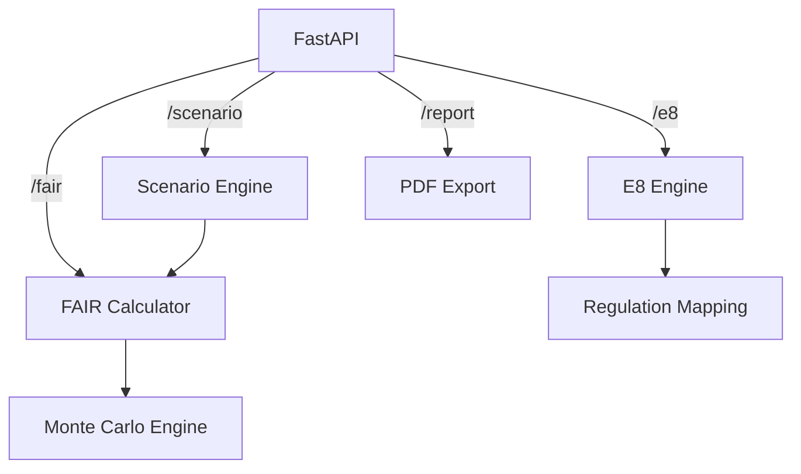

# Architecture Overview

## Components
- **FastAPI**: API surface with routers for Essential Eight, FAIR, scenarios, and reporting.
- **EssentialEightEngine**: Validates inputs, computes control heatmaps, and aggregates maturity with recommendations.
- **RegulationMapper**: Generates Privacy Act, SOCI Act, and APRA CPS 234 signals when controls are weak.
- **FAIRCalculator**: Samples distributions and performs Monte Carlo simulations (default 10k iterations, hard minimum 1k).
- **RiskMapper**: Scales FAIR parameters based on weakest Essential Eight controls to reflect increased exposure.
- **ScenarioEngine**: Predefined threat scenarios with adjustable FAIR baselines.
- **PDF Exporter**: Lightweight executive reporting using `fpdf`.

## Data Flow
1. Client submits E8 maturity responses to `/e8/score`; regulatory signals are derived.
2. Output feeds `/scenario/run` where FAIR parameters are adjusted via `RiskMapper`.
3. `FAIRCalculator` runs Monte Carlo and returns percentile statistics.
4. `/report/pdf` accepts the combined payload and returns a generated PDF.

## Security Considerations
- Input validation via Pydantic schemas and server-side checks for FAIR parameter ordering.
- No secrets stored in code; uses configuration via environment if extended.
- CORS enabled for prototype; restrict origins before production deployment.
- Temporary files for PDF export are cleaned up by the OS after response; adjust pathing for hardened deployments.
